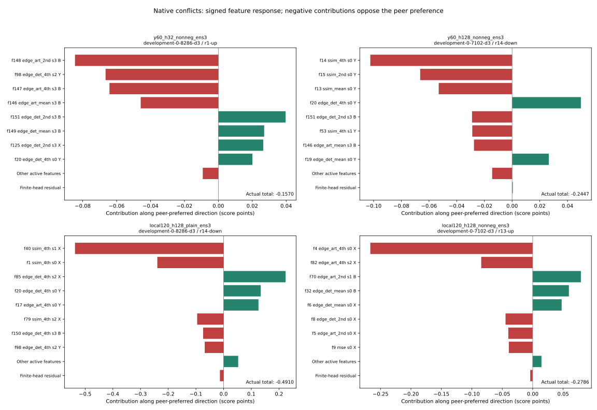

# Native preference failures traced to signed feature response

September 14, 2026. **All 22 conflicting preferences are already wrong in the feature-level linearization.** Large head nonlinearity is unnecessary to explain these failures. The strongest local120 conflict contributions come from learned positive sensitivities to X-channel dissimilarities. A y60/H32 failure instead follows coarse B-channel feature changes. No extraction arithmetic defect or shipping improvement is established.

## Measurement and parity

Reuse the exact eight TRAIN-development native JXL cells and six frozen Rev3 ensembles from the constrained-head study, plus frozen Rev1 D. No fits, calibration, new encodes, new feature formulas, EVAL or TEST. The complete public native replay already computes baseline feature sensitivities for its linearization. The existing `ZENSIM_ATTR_DIAG=1` flag now retains them; it adds no scoring or derivative implementation.

The ordinary six-model replay is byte-identical to its original output. Removing only the new sensitivity field makes both diagnostic replays equal their frozen originals. All 56 model/cell sensitivity vectors are retained. Across 1,792 model/probe responses, the sum of per-feature terms reconstructs the owner’s linearization within 8.89e-16 score points. Different heads share exactly the same computed values on 97,886 common active feature comparisons. These checks verify reporting and feature-path agreement, not independent correctness of the feature formulas.

For each feature, the reported term is `baseline_sensitivity × (probe_feature − baseline_feature)`. The finite-head residual is actual served score delta minus the summed terms. Names, scales and channels follow the pinned canonical basic156 definitions. Model derivatives remain local approximations; grouped contributions are not retraining or feature-ablation results.

## All registered native conflicts

| Complete ensemble | Conflicts /79 | Also wrong in linearization | Largest residual on conflicts | Positive-sensitivity share of opposing component mass |
|---|---:|---:|---:|---:|
| PT914U_y60_h32_plain_ens3 | 0 | 0 | — | — |
| PT914U_y60_h32_nonneg_ens3 | 1 | 1 | 0.000054 | 25.4% |
| PT914U_y60_h128_plain_ens3 | 0 | 0 | — | — |
| PT914U_y60_h128_nonneg_ens3 | 5 | 5 | 0.004674 | 66.4% |
| PT914U_local120_h128_plain_ens3 | 10 | 10 | 0.066232 | 92.9% |
| PT914U_local120_h128_nonneg_ens3 | 6 | 6 | 0.009313 | 90.2% |
| D_frozen_revision1 | 0 | 0 | — | — |

The last column sums absolute contributions opposing the registered SSIM2/Butteraugli preference, restricted to conflict cases, and measures the portion with positive feature sensitivity. It is not a population failure rate. Positive sensitivity to a dissimilarity can be a learned masking/correlation tradeoff; it is not automatically a software bug. SSIM2 supplied training labels and neither peer is human ground truth.

The four examples are the largest existing conflict for each affected model, not a new selected evaluation population. Bar sums, including other features and the finite-head residual, equal the complete observed score change along the peer-preferred direction. Negative bars oppose that preference. Exact source/baseline/intervention images remain in the linked gallery.

## What the failures imply

**Local120 plain:** 10 conflicts; 92.9% of opposing component mass has positive sensitivity. Summed conflict-oriented X contribution is −3.431 score points, while Y contributes +.887 and B +.335. On the worst screen intervention, X-channel SSIM fourth moments at scales 1/0/2 contribute −.537/−.239/−.095 toward the peer preference. The model rewards increased dissimilarity on that path. Its actual wrong-direction gain is +.491, versus linearized +.478.

**Local120 nonnegative-distance:** six graphic conflicts remain; 90.2% of opposing component mass has positive sensitivity. Its worst improving intervention reduces X edge-artifact fourth moments, but positive model sensitivities turn those reductions into penalties: −.267 at full resolution and −.085 at scale 2. Nonnegative output distance constrains the score ceiling; it does not make the score monotone in every input feature.

**Y60/H128 nonnegative-distance:** all five conflicts persist in linearization. Its worst graphic example increases full-resolution Y SSIM dissimilarity, yet positive sensitivities produce an incorrect score reward; the three Y SSIM pools account for .222 points against the peer preference. Across its conflicts the coarsest scale is also a substantial contributor.

**Y60/H32 nonnegative-distance:** one screen conflict. Here only 25.4% of opposing mass has positive sensitivity. Coarsest B edge-artifact features increase despite the peers preferring the intervention; conventional negative sensitivities penalize those increases. Its summed scale-3 contribution is −.137 while full-resolution contribution is +.063. This is a feature-response disagreement worth investigating; it does not by itself prove downsampling aliasing or a kernel defect.

## Consequence for the next experiment

Do not globally delete X or B from these observations, and do not spend another cycle on map-gradient algebra: these failures exist in the scalar model’s local feature response. The existing TV pair-margin owner is a candidate for a bounded, clean native-pair comparison that supervises actual local preferences without imposing global input monotonicity. First verify pair indices, group ordering, quality polarity, reached loss path and sampling effects using only admitted TRAIN fitting rows. The older best-of-all hinge improved global monotonicity but did not solve codec floors; no general solution is assumed here.

Separately, the coarse-B case warrants phase/filter diagnostics against its exact saved pixels before changing scales or kernels. These are different mechanisms and should not be conflated into an undirected capacity or feature sweep. Existing human/scatter/tail, corruption, target-loop, native-RD, HDR and runtime gates remain unchanged. No model qualifies.

Artifacts: `~/work/zensim-validation-2026-09-14/native-contributions/`; [comparison and exact A/B gallery](/zensim/reports/native-contributions-2026-09-14/index.html); [compact results](native_contributions_2026-09-14.results.json). The prior [constrained-model study](native_constraints_2026-09-14.md) owns the frozen population and scalar panels. The full product goal remains active.
