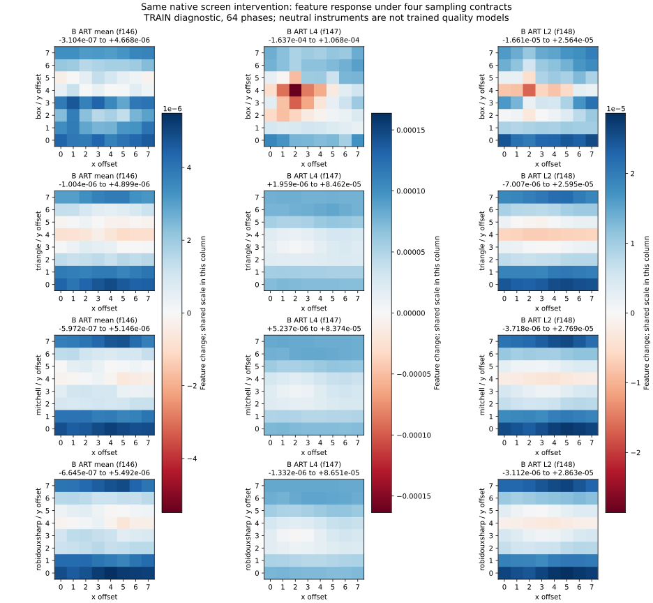

# Native filter comparison reduces some phase variation, not the conflict

September 14, 2026. Triangle, Mitchell and RobidouxSharp reduce the focal
coarse-B artifact L4 feature's phase span by 68–71% relative to cascade box.
They increase the artifact mean span by 15–24%. Triangle and Mitchell make
L4's change positive at all64 alignments: a conventional negative model weight
would penalize this native intervention more consistently. Reduced variation
alone does not resolve the perceptual preference conflict or select a model.

[Served figures and original native A/B context](/zensim/reports/native-filter-2026-09-14/index.html).
[Complete measurements](native_filter_2026-09-14.results.json).
This follows the [frozen-model phase diagnostic](native_phase_2026-09-14.md).

## Controlled comparison

Four **neutral measurement instruments**, all with the same60 live feature IDs
as y60/H32: Y at scales1/2/4/8 and X/B at scale8. A single f32 linear layer uses
unit input scalers, weights−.1 and bias100. They are not trained quality models;
their scores and maps cannot qualify a product. The existing Rust
`zenpredict-bake` produces ZNPR v3 bytes. Public `BakeScorer::compute` and
`prepare_steering` execute extraction, complete instrument inference and bin8
maps. There is no new scorer, resizer, feature formula or production API.

Contracts are the existing cascade box and direct-from-original
`v2:xyb:{triangle,mitchell,robidouxsharp}:1,2,4,8`, formula revision3.
The pinned zenresize revision `e3975fb9d6d6b7baa96038a0eb8e27febb37c012`
matches main at execution. Direct paths include binary16 input quantization
inside the resizer. Thus this measures complete implemented sampling contracts,
including precision and pyramid construction, not an isolated kernel effect.
The precision clarification was recorded during execution before reading results.

The exact eight admitted TRAIN-development native JXL cells, four source
families, two distances, all interventions and130 translations are reused.
Screen8286/distance3 has64 residues plus three period controls; other cells
have six residues plus three controls. Reference and decoded pixels move
together inside the same fixed black canvas, with at least64px margins and
no cropping or re-encoding. The focal intervention is the previously diagnosed
r1-up; it is not a representative population sample. No fitting, calibration,
new sources, EVAL, TEST or native encoding occurs.

## Focal results

Each span is the maximum minus minimum feature change over64 alignments.
Positive feature changes indicate more measured artifact, not human truth.
Ratios compare the same feature's span against box; scales differ between features.

| Contract | B ART mean span / box | B ART L4 span / box | B ART L2 span / box | L4 positive / negative phases |
|---|---:|---:|---:|---:|
| Cascade box | 1.0000 | 1.0000 | 1.0000 | 47 /17 |
| Triangle | 1.1858 | .3056 | .7799 | 64 /0 |
| Mitchell | 1.1537 | .2902 | .7433 | 64 /0 |
| RobidouxSharp | 1.2366 | .3247 | .7513 | 63 /1 |

Box absolute spans are4.97838e-6 (mean/f146),2.70521e-4 (L4/f147),
and4.22542e-5 (L2/f148). Triangle L4 changes range from+1.95946e-6
to+8.46236e-5; Mitchell from+5.23735e-6 to+8.37418e-5; RobidouxSharp
from−1.33167e-6 to+8.65096e-5. Full-resolution features are exactly the same
across all four contracts for every scored pair.

The original unpadded intervention improves same-pixel SSIM2 by+.11331 and
Butteraugli quality by+.009796. These are peer responses, not human labels;
SSIM2 also supplied training supervision. Padding alters context and dilution,
and SSIM2 itself changes preference across phases in the preceding study.
Do not use an arbitrary phase's peer score as a definitive quality label.

## Integrity, controls and limits

All4,562 original/padded pixel-and-peer rows exactly reproduce the prior study.
All273,720 live box feature values reproduce exactly. The Rust owner asserts
exact prepared/scalar baseline score and feature parity for all552 maps.
All four instruments have complete density/refinement coverage. These are
API/coverage checks, not proof of native steering benefit.

Period-eight controls retain the earlier tolerance
`1e-6 + 1e-5*abs(origin feature)`. Each contract fails6/24 whole-cell controls,
all at full-resolution Y SSIM-L4/f14:32 violations across contracts, representing
the same eight probe/offset instances. Maximum error1.69213e-6, maximum tolerance
ratio1.10204. **Every focal baseline/r1-up period control passes.** The unchanged
full-population failures remain failures. No widened tolerance is introduced.

The existing independent f64 separable-tap reference test passes for all three
kernels and all three declared divisor sets, including binary16 input rounding
and an unquantized negative control. It checks resizer arithmetic on a synthetic
97×131 input; it does not establish perceptual correctness or universal precision.

Bin8 rectangle queries change alignment under sub-eight translations. Direct
sampling geometry distributes ownership with normalized squared interpolation
taps; it is not the derivative of signed interpolation. No map ranking or native
rate–distortion gain is inferred from these neutral instruments.

The replay measures18,248 instrument pixel scores,552 prepared maps and9,124
peer comparisons in182 seconds. A concurrent reference-test build prevents
interpreting workflow time as a controlled serving benchmark. All per-feature,
per-intervention spans and failed controls are retained in the downloadable
evidence. Four families and unequal phase coverage do not support class-risk
estimates or a feature-capacity ceiling.

## Decision and reproduction

No contract uniformly reduces the three focal feature spans; none establishes
that the quality conflict is fixed. Do not replace the frozen model's sampling
metadata or begin an immediate kernel-parameter sweep. A trained comparison
must re-extract its admitted TRAIN inputs under the declared contract and refit,
then assess complete human, dial, tail, native-response and runtime panels.
Precision, feature normalization and lost useful signal remain distinct questions.
No model advances and all product qualification requirements remain open.

The served evidence contains protocol, exact manifests and hashes, neutral bake
requests/bytes, pinned replay, original pixel inputs, analysis, reference-test
log and full results. `REPRODUCE.md` provides a portable replay command. The
existing gallery retains the earlier unpadded six-model plus D comparison and
A/B images explicitly as context; its model table is not this neutral experiment.
