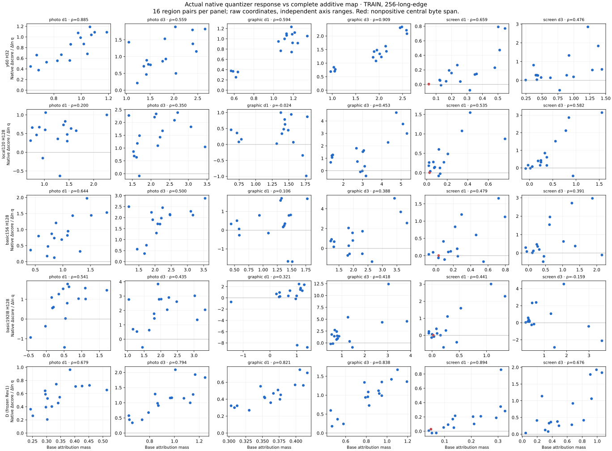

# Rev3 models on actual native JXL interventions

September 14, 2026. **No model qualifies.** The earlier reference-repair pass for y60 does not establish good native encoder allocation. In this matched TRAIN packet, frozen revision1 D has stronger native map association than the new ensembles. Several richer new models also have scalar preference conflicts with both independent judges. These are distinct gaps.

## Population and execution

Reuse retained native JXL bitstreams from the September8 coarse4 intervention experiment: three admissible TRAIN families (photo2010, graphic7066, screen8206), two renditions (long edge256/512), distances1/3, sixteen whole-transform unions and two fixed local quantizer changes per union. Each of twelve cells has baseline, exact neutral repeat and32 probes. All transformations and quantizer probes were already generated; this replay runs no new encoder or allocator.

The old document family6068 is excluded before pixel access because it intersects the later suffix8 reservation. Canonical source/family metadata and all historical exclusions are checked first. Empty family means origin:<id>, never one shared empty family. The three families can overlap fitting data: this is development evidence, not independent EVAL. No TEST, terminal, reserved-family pixels, fitting, checkpoint selection or calibration was accessed.

All408 admitted bitstreams are decoded anew through the hash-verified canonical native decoder. Previous decoded pixels and judge values are not reused across decoder eras. Source PNGs, bitstreams, requested/captured quantizers, transform/group geometry, models, executables and new PNGs are bound by hashes. Whole-transform partitions and requested rounding are independently checked; captured quantizer changes outside each group are zero. Frozen strategies/global quantizer configuration inherit the original producer and its retained validation.

The existing `diffmap_block_coherence` owner now accepts a hash-bound native-intervention manifest. It computes every base map before reading probe pixels. Complete Rust `BakeScorer` ensembles own scalar/features/sensitivities/maps; same-buffer Rust fast-ssim2 and Butteraugli pnorm3 judge every probe. Explicit formula revisions are checked against the process. A secondary matched D control uses its original revision1 and exact shipped bytes, never D coefficients at revision3.

Primary work:72 base maps,2,448 ordinary candidate pixel calls,816 peer calls. D adds12 maps,408 pixel calls and816 peers. Final-source reproduction repeats the primary work and produces byte-identical JSON. Primary and D peer values and pixel hashes agree exactly. Neutral score/features/pixels and map/scalar base parity pass. Eleven negative controls refuse invalid roles, unadmitted sources, hashes, geometry, neutral pixels and revision mismatch. No production encoder/scorer API or formula changes. Across the primary, D and final-source replay, completed science work totals156 maps,5,304 ordinary pixel calls and2,448 peer calls. The expected bad-neutral refusal additionally reaches six maps, six ordinary calls and two peers before failing; other refusal cases stop before scoring. Total scored work is162 maps,5,310 ordinary calls and2,450 peers, plus408 fresh native JXL decodes.

## Native response, not a reference-repair or RD gate

For each group, native response is (score_up−score_down)/(mean_log_q_up−mean_log_q_down). Compare its rank against base group attribution mass. Separately compare density with score gain per byte on strictly positive central byte spans, retaining all nonpositive spans explicitly. M2 uses actual per-probe feature changes and the base complete-model sensitivity. Statistics come from the existing Rust `panel` owner. The .99/.70 lines are diagnostic references, not newly weakened release gates.

Hard-max ensembles do not have complete additive density. Their density rows below are partial diagnostics and cannot pass a complete-map gate. The implementation never sums non-additive rectangle gains over irregular unions or replaces those unions with bounding rectangles.

| Model | Complete density cells | Native M2 below .99 | Mass/response rank, median / minimum | Density/gain-per-byte rank, median | Robust peer conflicts /160 |
|---|---:|---:|---:|---:|---:|
| basic228 H128 | 0/12 | 4/12 | 0.157 / -0.188 | 0.182 | 14 |
| basic228 H32 | 0/12 | 2/12 | 0.224 / -0.274 | 0.312 | 13 |
| y60 H32 | 12/12 | 0/12 | 0.651 / 0.362 | 0.518 | 0 |
| local120 H128 | 12/12 | 0/12 | 0.401 / -0.024 | 0.237 | 11 |
| basic156 H128 | 12/12 | 0/12 | 0.376 / -0.088 | 0.162 | 15 |
| basic192l8 H128 | 12/12 | 1/12 | 0.369 / -0.159 | 0.130 | 27 |
| D (frozen Rev1) | 12/12 | 0/12 | 0.815 / 0.412 | 0.715 | 0 |

Y60 falls below native mass/response rank .70 in7/12 cells; D in4/12. Every richer complete-density model is below that reference in11/12. At least one cell has negative density/gain-per-byte association for every model, including D. This does not establish a winning native allocation policy.

The figure shows every256-rendition cell for the five complete-density models, with unnormalized coordinates and individual axes. It does not pool away per-image failures. Full512 results and partial-density controls remain in the machine-readable case tables.

## Scalar preference conflicts

The secondary diagnosis was registered after observing the primary ranks, before computing its counts. Require both independent peers to agree beyond existing native margins: SSIM2 .1 and Butteraugli .005; count an opposite Zensim change exceeding .1. All models see the same160 qualifying comparisons:50 peer-consensus improvements and110 deteriorations. D and y60 have zero such conflicts. Richer models have11–27. These peer conventions are not human truth or new release thresholds.

For example, on the graphic256/d1 r10-down intervention, basic192l8 increases by4.164 score points while SSIM2 decreases.203 and Butteraugli worsens.006712. This is a complete scalar response to a real encoded output, not a map projection error. Correcting map arithmetic alone cannot fix that preference.

The served comparison at `/zensim/reports/native-map-replay-2026-09-14/index.html` shows exact native A/B examples: the largest signed conflict per affected model, with unchanged reference/baseline/probe PNG bytes. They are selected failure illustrations, not a representative sample.

## Decision and next experiment

Keep all six candidates frozen and unqualified. Do not promote y60 on its earlier23/23 reference-repair result, or treat partial hard-max density as native steering support. D remains a stronger matched native control here but retains its existing allocation/RD failures and unmeasured product requirements.

Prioritize a registered TRAIN-only local-native preference experiment over more fixed-gradient algebra or another capacity sweep. Test whether native local ranking supervision improves these scalar preferences without sacrificing the existing human, codec-floor, near-lossless and scatter/tail panels. Generate broader admissible TRAIN-family coverage before fitting; keep this diagnostic packet distinct from fitting and future frozen evaluation. Map utility and native matched-RD allocation still need separate tests after scalar preferences improve.

Three families, one codec/configuration family, two modest image sizes and32 probes per cell cannot establish general quality, target attainment, HDR, runtime or shipping. The full goal remains active.

## Reproducibility

Local packet: `~/work/zensim-validation-2026-09-14/native-map-replay/`. `REGISTRATION.json`, `ADMISSION.json`, `REPLAY.json`, original/final executables, native PNGs, quantizer/geometry hashes, complete features/results, raw canonical panel outputs and the secondary registration are retained. No data or model artifact is overwritten. A launcher syntax error preceded work; a later baseline analysis filename error was corrected with exact result-byte equality. Both original scripts/artifacts remain.

CI-exact Clippy and formatting/script lint pass. The minimal-feature example build passes with one existing `append_on` unused-variable warning in unchanged `feature_v2.rs`. Public library behavior is unchanged. The primary run took16.53 seconds including all peers and instrument work; this is not a latency qualification or speedup.

[Compact results](native_map_replay_2026-09-14.results.json) link all evidence by hash. Served packet: `/zensim/reports/native-map-replay-2026-09-14/`.
