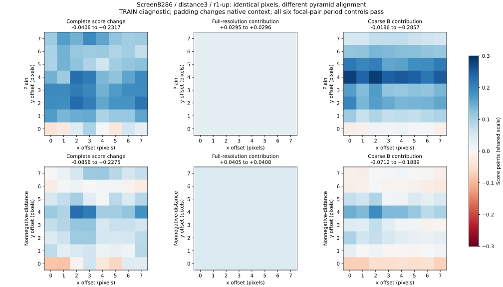
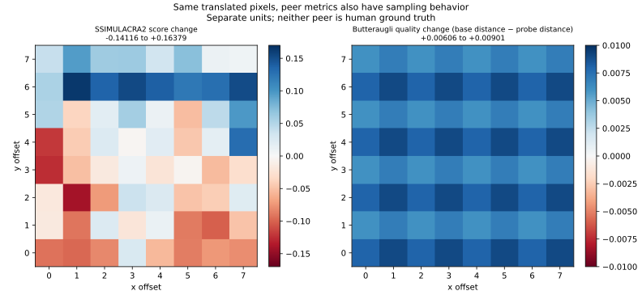

# Native coarse-B response depends on sampling alignment

September 14, 2026. On the previously identified screen intervention, moving
the same reference/decoded pixels together changes the constrained y60/H32
model's preference: its score delta spans **−.08581 to +.22750** across64
alignments. Coarse-B contributions vary substantially while full-resolution
contributions remain nearly constant. This is evidence about an existing
feature response, not a new trained model, improved filter, or shipping result.

[Served phase plots and original native A/Bs](/zensim/reports/native-phase-2026-09-14/index.html).
The [signed contribution study](native_contributions_2026-09-14.md) identified
this case before the current protocol was registered. The
[TV recipe](native_tv_train_2026-09-14.md) remains rejected independently.

## Experiment and controls

Reuse the same eight native JXL TRAIN-development cells: four source families,
two distances per family. Retain the frozen y60/H32 plain and nonnegative-distance
three-member ensembles. No new sources, encodes, fitting, calibration, kernels,
feature revision, EVAL or TEST. Every original pixel remains in a fixed black
RGB8 canvas; reference and decoded images receive the same translation. Canvas
dimensions are `ceil((original + 144)/8)*8` per axis, with minimum64px margins.
Padding changes boundary context and dilution relative to unpadded images.

The focal screen8286/distance3 cell receives all64 `(x,y)` residues0..7, plus
period controls `(8,0)`, `(0,8)`, `(8,8)`. Seven other cells receive six residue
positions and the same three controls. All32 native interventions per cell are
retained. The native replay's existing public Rust `BakeScorer` executes complete
scores, baseline sensitivities and prepared bin8 region queries. It also scores
same-buffer SSIMULACRA2 and Butteraugli. No replacement scorer is introduced.

The ordinary six-model replay remains byte-identical. The two-model unpadded
slice reproduces544 pixel scores/features and16 maps exactly. The diagnostic
adds130 translated cells,260 maps,8,580 candidate pixel scores and8,580 peer
comparisons. The Rust run completes in101s; canonical analysis in about1s.
These are workflow elapsed times, not qualified serving benchmarks.

Three cascaded2x box reductions produce an8x lattice in exact arithmetic.
A joint8px translation preserves all four sampling phases; sub-eight shifts
change which neighborhoods enter coarse samples. The fixed canvas and margin
hold pixel count and remote boundary context constant across offsets. Floating
point arithmetic and map binning still require actual controls.

**The full control screen does not pass:**12/48 cell/model checks exceed the
registered feature tolerance `1e-6 + 1e-5*abs(value)`. All failures are feature14,
full-resolution Y SSIM-L4: eight unique probe/offset instances across document,
graphic and screen distance3, shared by both heads. Maximum feature discrepancy
is1.69213e-6, maximum tolerance ratio1.10204. Every absolute score control passes
the unchanged1e-3-point bar; the largest error is7.88371e-5 points. Failures are
preserved, not relabelled as passes or assigned a wider post-hoc tolerance.

Retrospective localization distinguishes those failures from the preregistered
focal baseline/r1-up pair: **all six focal pixel-pair/offset controls pass**
for both models. The failed feature instances concern other interventions.
This supports the focal sampling-response interpretation without establishing
a numerically clean whole-population screen. The earlier
[real-image precision record](precision_rev3_2026-09-14.md) already limits
universal locality/precision claims; this study does not prove a new arithmetic
root cause or justify writing another SSIM kernel.

## The focal native intervention

Screen8286 is144×256; the retained r1-up intervention changes only its original
codec transform union. Its unpadded peer changes are SSIM2 +.11331 and
Butteraugli quality +.009796. Those original eligibility decisions remain frozen.
Padded images are diagnostic transforms, not newly encoded codec outputs.

| Quantity | Plain y60/H32 | Nonnegative-distance y60/H32 |
|---|---:|---:|
| Original unpadded score change | −.07396 | −.15701 |
| Padded offset0,0 score change | −.04075 | −.08318 |
| All64 phase score-change range | −.04075 to +.23171 | −.08581 to +.22750 |
| Positive / negative phase changes | 61 /3 | 54 /10 |
| Full-resolution contribution range | +.02952 to +.02963 | +.04052 to +.04083 |
| Coarse-B contribution range | −.01861 to +.28570 | −.07117 to +.18889 |

The three coarsest B artifact features have conventional **negative** model
sensitivities at every focal phase. For the constrained head, their ranges are
approximately−4486..−4455 (mean),−471..−468 (L4), and−2016..−2005 (L2).
The feature changes themselves cross zero: mean−3.10e-7..+4.67e-6,
L4−1.64e-4..+1.07e-4, and L2−1.66e-5..+2.56e-5. This differs from the
local120 conflicts dominated by positive sensitivities. All1,595,880 compared
feature entries agree exactly between the two heads; the score responses use
their different learned sensitivities. Linearized contributions reconstruct
the existing owner's result; large head nonlinearity is unnecessary here.

SSIMULACRA2 is also phase-sensitive on these same pixels: its delta spans
−.14116..+.16379 and changes sign. Butteraugli quality delta stays positive,
.006065..+.009005. Neither is human ground truth, and SSIM2 supplied training
supervision. An arbitrary SSIM2 phase cannot be promoted to a definitive label.

## Spatial and class context

Canonical Rust panels assess all260 phase/model cells. On the focal64 phases,
M2 minima are.999633 for plain and.999267 for constrained, while own-score
map-mass/response rank varies .335.. .774 and .376.. .779 respectively.
The constrained map's SSIM2 association spans .200.. .868; Butteraugli
association spans .456.. .782. High local linearization consistency still does
not establish reliable allocation.

Maps retain bin8 storage. Sub-eight translated region boundaries also cross
map bins, so map-mass variation includes query discretization; it is not a pure
measurement of resizer phase. Scalar features do not use rectangle queries.
No native rate–distortion or original repair gate is claimed to pass.

Across the sampled offsets, small signed model changes reverse in every content
class. Requiring both directions to exceed the existing .1-point model margin
leaves reversals only on screen content:1/64 interventions for plain and5/64
for constrained. Screen receives denser sampling on the focal distance3 cell,
so these counts are not balanced class-risk estimates. Full counts, all phase
rows, controls, and Rust mechanism panels remain in the evidence.

## Next decision and limits

The focal coarse-B disagreement is materially alignment-dependent. Its basic
edge normalization and learned sensitivities remain part of the response;
this experiment does not independently rank alternative normalizations.
Do not globally remove chroma or infer that averaging64 phases is a practical
runtime solution. A useful next feature comparison holds admitted TRAIN pixels
and exact definitions fixed while testing the existing zenresize sampling
contracts, then refits candidates before judging their quality. Changing a
frozen model's sampling metadata alone cannot qualify a replacement model.

Kernel quality, actual compute savings, representative human/scatter/tail
performance, codec targeting, native RD, corruption and runtime qualification
remain open. The complete gate set is unchanged; **no model is promoted**.

Artifacts and protocol: `~/work/zensim-validation-2026-09-14/native-phase/`.
The [compact result](native_phase_2026-09-14.results.json) binds full evidence
hashes. The gallery adds hash-bound diagnostic figures through the existing
renderer and retains the original unpadded table/scatter/A-Bs as explicitly
labelled context. It does not substitute translated outcomes for codec evidence.

Verification: all three example tests, Clippy, script lint and gauntlet page
gates pass. Invalid phase offsets refuse before pixel reads; a tampered figure
hash refuses publication. Rendering an old gallery without figures is
byte-identical. Chromium displays both phase figures correctly. All546 existing
board rows are unchanged; the only board-data addition is this TRAIN report.
All598 initially published files match their HTTP hashes, including the full
results, exact inputs/models and a relative-path replay manifest. The replay
bundle changes paths only and retains original input/model hashes.
[Download the replay bundle](/zensim/reports/native-phase-2026-09-14.zip);
`REPRODUCE.md` contains the command and platform requirements.
