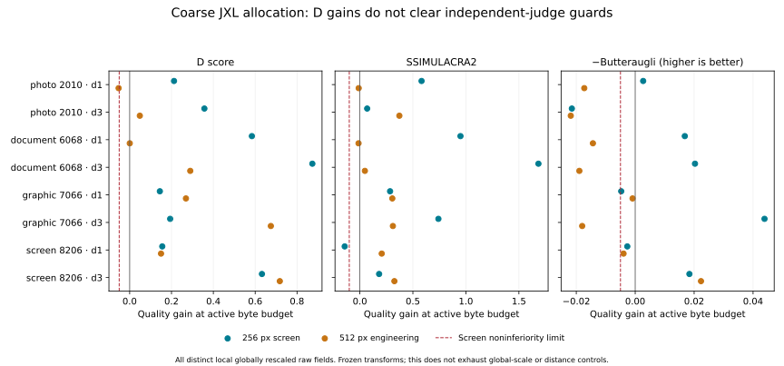

# Coarse JXL allocation policy — September 8, 2026

**The fixed policy fails its preregistered screen and will not advance to
broader validation. No model is qualified.** This is actual emitted allocation
output, extending the earlier intervention correlations. D improves against
the declared local scalar comparator in all eight 256-pixel cells, but two
independent-judge guardrails fail. At 512, additional weaknesses appear.

## The measured result

Exhaustive declared local raw-field rescaling comparator; no interpolation, full-codec optimum or general targeting qualification.

| Origin | Class | d | Scalar states | D gain at bytes | SSIM2 gain | −BA gain | Covered |
|---|---|---:|---:|---:|---:|---:|---|
| 2010 | photo | 1 | 28 | +0.211983 | +0.581828 | +0.002702 | True |
| 2010 | photo | 3 | 28 | +0.357170 | +0.068751 | -0.021502 | True |
| 6068 | document | 1 | 28 | +0.584244 | +0.948897 | +0.016834 | True |
| 6068 | document | 3 | 28 | +0.873283 | +1.684184 | +0.020291 | True |
| 7066 | graphic | 1 | 28 | +0.144318 | +0.284915 | -0.004745 | True |
| 7066 | graphic | 3 | 21 | +0.193642 | +0.740708 | +0.043887 | True |
| 8206 | screen | 1 | 39 | +0.155869 | -0.143189 | -0.002684 | True |
| 8206 | screen | 3 | 33 | +0.632355 | +0.181528 | +0.018401 | True |

At 256, the failed cells are photo 2010/d3 (Butteraugli worsens by 0.021502,
versus an allowed 0.005) and screen 8206/d1 (SSIM2 worsens by 0.143189,
versus an allowed 0.1). All eight cells lie within the attained scalar D/byte
bounds, and each gains at least 0.05 D. None is dominated by a single measured
scalar output on bytes and all three quality metrics. That tradeoff does not
pass the independently registered noninferiority requirements.

The separately registered 512 multigroup software check uses the same four
families. Photo 2010/d1 loses 0.052818 D at budget; five cells exceed the 0.005
Butteraugli loss limit. No validation or terminal family was evaluated. Larger
images cannot overturn the failed original screen.

## Comparator and policy

The private `zensim_diffmap_rd --native-interventions` owner adds
`--intervention-regions coarse-policy`. The same frozen e8 Reference transform
strategies, CfL/gaborish/pixel-loss configuration, D bake and complete Rust
surface are used in every arm. Native PNG IO and independent jxl-rs decoding
remain mandatory. Libjxl v0.12 is compatibility only.

Before computing the policy map, enumerate every distinct raw quantizer field
reachable by multiplying the original integer field by one common factor in
[2/3,3/2], half-up rounding and clamping to [1,255]. Exact rational breakpoints
avoid floating-grid omissions. The eight cells have 21–39 unique scalar states;
all are encoded, independently decoded and scored before policy application.
The independent Python analyzer re-enumerates them with rational arithmetic.

This exhausts that declared **local integer-field operation**, with frozen
transforms and global quantization. It does not exhaust the codec's separate
global-scale or distance controls, recomputed strategies, or full attainable
quality range. Thus positive values are not a general encoder-RD win. All
comparisons select actual measured scalar outputs; there is no interpolation
or extrapolation. Each judge's best-at-budget scalar may be a different output;
the JSON also records the single best-D scalar and all-metric dominators.

The policy receives only the original raw field and baseline complete-model
attribution grouped into 4×4 unions of whole transforms. Area-weighted centered
density, normalized by mean absolute deviation, gives factors clamped to
[0.8,1.2]. A common normalization preserves the initial quantizer sum before
integer rounding. This is a proxy for byte cost; measured bytes decide the
comparison. Zero densities go through the same function and must reproduce
the original raw field and exact neutral bytes/pixels/score. The policy has
no argument or read access to the measured scalar bounds, judges or finite
intervention derivatives. The scalar survey is evaluation work.

## Validation and cost

The 249-encode primary screen repeats exactly: bitstreams, raw and PNG pixels,
requested/actual quantizers, complete scores, policy/scalar-state metadata,
all 498 independent judge values and the failed verdict. The 266-encode
multigroup check also completes. All 24 neutral controls are exact; active
fields and decoded pixels engage in every cell. Thirty-six damaged-analysis
controls and eleven invalid-CLI controls are rejected. Prior coarse-intervention
statistics are unchanged, and unrelated analyzer functions are AST-identical.

Local scoped Rustfmt, CI-exact zensim Clippy, exact JXL example Clippy, all three
Clippy routes against the CI-pinned source closure, and 605-script lint pass.
No public API, library encoder behavior, baked model or default controller
changes. All changes stay in the existing private research owner and analyzer.

Including primary, reproduction and multigroup: 764 full encodes/JXL decodes/
ordinary scalar comparisons, 24 scored maps, 1,528 independent judge comparisons,
72 libjxl compatibility decodes, 12 source PNG decodes, 764 PNG roundtrip decodes
and 144 compatibility PNG reads. No internal reconstruction loop ran. The
isolated policy requires baseline + active (two full encodes) and one map;
its evaluator's exhaustive scalar survey is additional engineering cost and
cannot be hidden in a 1/2/3-shot product claim.

Final primary instrument: 2.338 s / 51,292 KiB peak RSS; multigroup: 7.479 s /
134,820 KiB. Stage times are retained. These whole-instrument observations are
not controlled product speedups or validated end-user targeting latency.

## Consequence and next action

This establishes correct execution and measurable map engagement, while
rejecting this particular D-plus-density allocation policy. It does not prove
whether the independent-judge losses arise from the model's spatial preferences,
the allocation rule, or their interaction. Keep that distinction explicit.

Before changing gains or spending validation families, preregister a comparison
using the strongest existing fully supported candidate maps under the same
fixed allocation rule, and include ordinary scalar quality control beyond this
local integer-field domain before making a product RD claim. Reuse complete
BakeScorer composition and the recovered native owners. Do not repeat the
finished D screen or relabel its failure as qualification. The separate
canonical corruption refit still awaits the requested EXR admission exception;
no new image-data fit occurred here.

## Reproduction

Artifact root: `/mnt/v/output/zensim/jxl-coarse-allocation-2026-09-08/`.
Model: `cd1098b450ef6941b6925b24bcbd129715b6f07c4fe84838a92e13ab364ddea6`.
Driver: `d71d1512f3b802488746a9f3febb52830fd9ff84e7fd31971d73249443841a67`.
`PREREGISTRATION.md` precedes the policy run; `REGISTRATION_MULTIGROUP.md`
separately records the later software-coverage check. `COMMAND*.json`, per-panel
`INPUTS.json`, `SCALAR_BOUNDS.json`, `scalar_states.json`, `POLICY.json`, original
bitstreams/RGB/quantizers, native readback hashes, judge commands, negative
controls and `REPRODUCTION.json` preserve the complete recipe and failure.
Build features: `__expert,zensim-loop,ssim2-loop,parallel,__pre_quantized,__internal_recon_hook`.
Analyze through the existing root owner with `--interventions <panel-directory>`.

Delivery rebase note: remote JXL advanced to `c0aedb14` during this screen.
Its new high-bit-depth sensitivity tests are preserved byte-for-byte. Its
regenerated lockfile did not match the pinned sibling graph and failed a
locked build; Cargo offline resolution restored the previously validated lock.
The rebased release instrument is byte-identical to the measured binary, so no
scientific result changed. The incoming lock, exact source comparison and
rebase/build/check logs are retained in `REBASE_VERIFICATION.json` and the
artifact packet. No force push or remote-history replacement was used.
