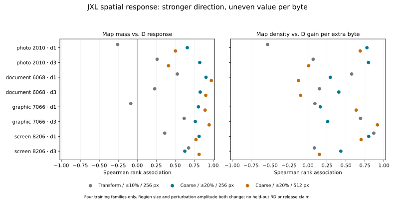

# Coarse JXL intervention screen — September 8, 2026

**Complete bounded training screen; no model qualification or matched-RD win.**
The coarse-region / ±20% recipe gives much more consistent native quality
responses than the earlier single-transform / ±10% recipe. The two factors
change together, so this does not isolate region size from perturbation size.

| Panel | D expected / opposite / flat | SSIM2 | −Butteraugli | Nonpositive central byte spans |
|---|---:|---:|---:|---:|
| native-parity-final | 123/95/24 | 127/91/24 | 166/49/27 | 34 |
| coarse-final | 244/12/0 | 232/24/0 | 252/4/0 | 1 |
| coarse-multigroup-final | 245/11/0 | 231/25/0 | 251/5/0 | 2 |

The transform panel has 242 nonzero captured-q changes; the coarse panels each
have 256. In the 256-long-edge coarse screen, map-mass association with native
D response is 0.626–0.906 across the eight image/distance cells. At 512 it is
0.412–0.976. Density versus D gain per byte remains uneven: 0.162–0.800 at
256, −0.126–0.915 at 512. The document cells at 512 have negative associations.
Independent judges also have weak/negative gain-per-byte associations in some
cells. Strong response direction does not imply efficient bit allocation.

## What was measured

The existing JXL `zensim_diffmap_rd --native-interventions` owner adds
`--intervention-regions coarse4`. Native whole transforms are grouped by their
anchor into a 4×4 spatial grid. Every padded block and clipped source pixel
belongs to one union; no transform is cut and no large-transform strategy is
disabled. All 16 nonempty groups receive both fixed quantizer probes. Signed
map mass/area, actual quantizers, decoded pixels, bytes and complete D scores
are retained. Every coarse probe changes pixels outside its transform union,
while no captured quantizer changes outside it; filter effects remain visible.

Use the same four canonical training origins 2010, 6068, 7066 and 8206, distances
1 and 3, effort 8 Reference, normal CfL/gaborish/pixel loss, frozen AC strategies
and exact decoder sRGB transfer. The 512 variants are the same families and
provide multigroup/scale coverage, not additional independent examples. No
fit, validation-family selection or terminal-label use occurred.

## Native IO and evidence integrity

The previous instrument used `image` for PNG IO and PIL in its analyzer; its
encoder and primary JXL decoder were native, but its entire IO path was not.
The private targeting/intervention owner now reads/writes with pinned zenpng
0.1.4, verifies exact RGB PNG readback, rejects unsupported source depth/color
metadata/alpha, and writes source/compatibility RGB hashes. The new v2 analyzer
uses raw buffers and hash-bound native readbacks. PIL remains only in the
historical v1 branch, which this experiment does not execute. The pinned CPU
zenmetrics judge already uses its native PNG decoder. Libjxl v0.12 remains a
port-compatibility comparison, never the scoring truth.

All 272 old transform probes reproduce bitstream, decoded RGB, score, requested
and actual quantizer fields and map integrals exactly with native PNG IO.
Native PNG compression may differ. The first new binary omitted four source
RGB sidecars; the analyzer refused it before statistics. After fixing that
recording bug and two Clippy slice-style findings, all three panels were rerun
from the final binary. All 816 probes and 1,632 judge values reproduce exactly.
Original prototypes, their failed analysis and final packets remain separate.

There are 24 verified final neutral cells, complete source/group/probe/judge
coverage, 31 rejecting analyzer controls and 11 rejecting CLI controls. Group
controls coherently change both group definitions and intervention records,
so matching copied metadata alone cannot pass. Existing unrelated analyzer
functions are AST-identical. No public encoder/scorer API or feature changed.
Native target calibration has a new explicit IO-era config identity; old
calibration files must not silently cross that identity.

## Work and limits

Final panels: 816 full encodes/native JXL decodes/scalar comparisons, 24 scored
maps, 1,632 independent judge comparisons and 72 libjxl compatibility decodes.
Including retained prototypes: 1,632 full encodes, 48 maps, 3,264 judge comparisons,
144 compatibility decodes, 24 source PNG decodes, 1,632 PNG readback decodes and
288 compatibility PNG reads. No internal reconstruction loops ran. Every count
is separate in the result JSON; these full-encode intervention probes are
engineering cost, not a proposed runtime controller.

Final process times/RSS: transform 2.337 s / 34,708 KiB; coarse256 2.356 s /
38,248 KiB; coarse512 7.734 s / 77,884 KiB. Per-stage times are retained. These
are instrument observations, not controlled product speedups or latency claims.

Next: preregister a bounded coarse allocation policy using the existing codec
owner, compare active/neutral against a strong scalar controller at matched
quality or bytes, and then validate train-calibrated actual 1/2/3-shot targeting
on separate families with per-image attained bounds. Do not promote these
correlations to a release gate or use these per-image oracle probes at runtime.
The canonical corruption refit separately still awaits the requested EXR
fingerprinting exception; this screen does not bypass its admission guard.

## Reproduction

Model: `cd1098b450ef6941b6925b24bcbd129715b6f07c4fe84838a92e13ab364ddea6`.
Final driver: `5e675d3d36818092e2fdc4210028e472ce44e7c98c5dc04669e9563334c1d553`.
Artifacts: `/mnt/v/output/zensim/jxl-coarse-interventions-2026-09-08/`.
`PREREGISTRATION.md`, `COMMAND_*-FINAL.json`, `INPUTS.json`, source/quantizer/RGB
files, per-panel `JUDGE_COMMANDS.json`, `REPRODUCTION.json`, `ANALYSIS_CONTROLS.json`
and local check logs preserve the exact recipe and failures. The existing root
analyzer runs with `--interventions <panel-directory>`. Build features are
`__expert,zensim-loop,ssim2-loop,parallel,__pre_quantized,__internal_recon_hook`.
