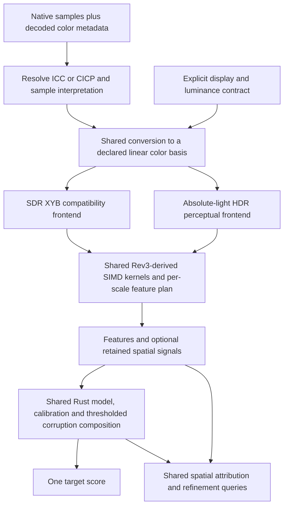

# Rev3 optimization and unified color contract

September 14, 2026. Latest user direction, following the baseline-recovery
instruction: optimize Rev3, including arithmetic if needed, especially peaks
and spatial maps. Exercise native precision, ICC and HDR; keep the model and
implementation as unified and auditable as practical. This amends the recovery
protocol's treatment of color as a separate future scope. It does not freeze
Rev3 arithmetic forever or authorize mixing incompatible caches.

## Findings at fa6670ba

- Current recovery is Rev3/full944 extraction with **legacy RGB8 SDR** input.
  CID22 TRAIN is complete; SafeSyn is still running. These are useful controls,
  not proof of color/HBD/HDR correctness or a required full944 runtime.
- Native SDR already preserves known u16 samples and declared primaries, and
  handles arbitrary ICC through the existing CMS. Its public scoring route
  uses an sRGB display with clipping. That can hide out-of-gamut differences;
  it is not a wide-gamut qualification contract. See the dated
  [native SDR implementation and numerical corrections](../benchmarks/native_sdr_contract_2026-09-14.md).
- HDR already has PQ/HLG/absolute-linear and PU-XYB entry points sharing the
  streaming feature walk. However, `hdr_source_row_to_nits` currently does
  not normalize source primaries, and the public extraction documentation
  explicitly says primaries are taken as-is. A common numeric RGB triplet is
  not a common color across sRGB, P3 and BT.2020.
- The existing fast-ssim2 dependency accepts linear f32 RGB. The native-input
  refusal in `extract_features_372col/audit.rs` is an adapter limitation, not
  a reason to write a new SSIM kernel. A float SDR teacher is not an HDR oracle.
- Hard-max maps already retain separable row/column projections with exact
  rectangle-removal semantics, including ties. Reimplementing that reduction
  would repeat completed work. Basic and L8 map combines still independently
  load the same retained planes and compute the same edge ratio.
- The current candidate map path computes the planned score, then performs
  another retained basic/peak walk. Avoiding repeated extraction is a larger
  opportunity than merely shrinking the final map. Sensitivities depend on
  completed features, so fusion must preserve that dependency.

## Intended ownership

The diagram is the intended architecture, not a claim that all those routes
are currently wired or qualified. Reuse `score_input`/decoder/CMS, `color`,
`transfer`, the existing streaming frontends, `feature_plan`, `BakeScorer`
and `attribution`. No independent SDR/HDR feature or scoring implementations.
The working color basis must match the opsin transform; changing the basis
without transforming the matrix is another color bug. Avoid an intermediate
sRGB gamut clamp on the native wide-gamut/HDR route. Validate the handling of
out-of-gamut and negative intermediate components before the nonlinearity.

Unify feature definitions, model format, inference, calibration ownership and
audit records first. Prefer shared SDR/HDR weights, but test that hypothesis
using matched TRAIN supervision. A shared implementation does not prove one
weight set is calibrated for both. Display parameters describe viewing
conditions; they must not become a second user quality dial.

Matching ICC profiles alone does not make an sRGB EOTF/opsin transform correct.
Exactly identical pixels with matching interpretation may take the existing
identity shortcut. For different pixels, a profile-specific fast path needs
equivalence evidence against the color-managed path. Keep native precision
through conversion; do not quantize HBD/HDR to run an SDR-only instrument.

## Execution order and stop conditions

1. **Complete the running recovery and admit its color scope.** Verify full
   counts and labels, preserve the original oracles, and retain the RGB8 input
   era. Before using those rows for a native-color model, inspect the explicit
   admitted TRAIN inputs' decoded color authority and producer interpretation.
   Re-extract affected rows under a frozen common contract; never relabel the
   legacy cache as native. Restore the established TRAIN mixture, sampling and
   calibration rather than another small KADID-only experiment.
2. **Optimize maps without changing learned semantics first.** Profile the
   prepared path by conversion, extraction, retention, combine and query cost.
   Test fusing the basic/L8 combine to reuse loads, division and powers while
   preserving f32/f64 rounding order. Then test retaining the required signals
   during planned extraction and consuming them after model sensitivities are
   known. Reuse worker scratch and reference caches. Retain exact max ties and
   finite-removal behavior; a smooth replacement for max is a distinct feature
   experiment, not an equivalent optimization.
3. **Close the shared native-input correctness gap.** Extend the existing
   audit to native linear-float SDR teacher input, preserving hashes of both
   original samples and transformed peer buffers. Use the existing conversion
   owner and independent colorimetry checks: prior generic conversion attempts
   failed numerical gates. Define explicit transfer, primaries, white point,
   absolute units, display peak/black/ambient, range, alpha and clipping for
   HDR. Normalize primaries before the opsin transform and exercise distinct
   source/destination encodings. Version changed semantics; do not silently
   change the interpretation of historical HDR weights or features.
4. **Permit consequential arithmetic changes.** Once measured hotspots are
   known, test SIMD-friendly formulations of the same formulas against the
   independent numerical reference. If values or peak/spatial semantics change,
   give the experiment a new formula identity, regenerate affected TRAIN
   features and refit. Do not spend another matrix of training experiments on
   a purported optimization that saves no served compute.
5. **Recover quality and qualify frozen products.** Initially keep one fast
   and one richer peak-capable regime, matched B/C/D controls and adequate
   established training. Use TRAIN only for all development choices. Assess
   frozen final Rust compositions with the complete composite, scatter/tails,
   attainable codec bounds, 1/2/3-shot targeting and native spatial outcomes.
   Cover native SDR/HBD/HDR explicitly. Missing HDR evidence remains incomplete;
   SDR SSIM2 agreement cannot substitute for HDR perceptual validation.

## Required discriminating checks

| Area | Evidence before accepting a change |
|---|---|
| Arithmetic and SIMD | Independent reference; identity and tiny differences; sparse impulses, salt/pepper and grids; supported SIMD tiers, tails and small/odd geometries. |
| Peaks and maps | Canonical consumed-feature and complete scalar parity; max ties, isolated peaks and rectangle boundaries; L8 mass/finite-root behavior; dense and binned maps; prepared-session reuse; native encoder intervention. |
| Color | Same physical colors encoded in different profiles/transfers; different colors with identical sample codes; arbitrary ICC versus known-matrix references; decoded-profile authority preventing double conversion. |
| HBD | Errors solely in low bits remain visible; matching u8/u16 representations agree within an explicit numerical budget; f32 input stays native precision. |
| HDR | PQ/HLG/linear representations at matched viewing conditions; common-primary equivalence; dark detail, highlights and wide-gamut differences; no SDR clipping/quantization detour. |
| Performance | Quiet, pinned paired before/after runs, real TRAIN images and multiple sizes; p50/p95, memory, scalar and prepared map, reference setup and reused-worker cost reported separately. |

Existing timings suggest maps deserve priority: basic228/H128 was about
18.23 ms scalar versus 86.10 ms prepared at 1MP. Those runs carry timing-admission
limitations and are descriptive, not a new speed gate or a predicted speedup.
See [latency methodology and corrections](../benchmarks/native_latency_2026-09-14.md).
The [TRAIN peak study](../benchmarks/product_peaks_2026-09-14.md) found useful
quality contributions from peaks and mixed spatial results; dropping them for
speed alone is not established as a good product choice.

This document records inspection and the revised implementation order. It
contains no new kernel optimization, benchmark result, trained model or HDR
qualification. The current recovery remains live and separately verifiable.
